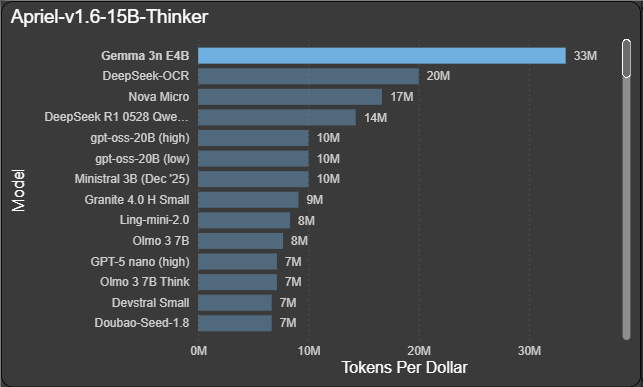
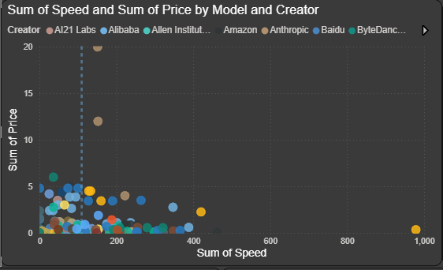
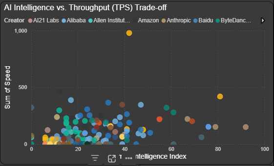
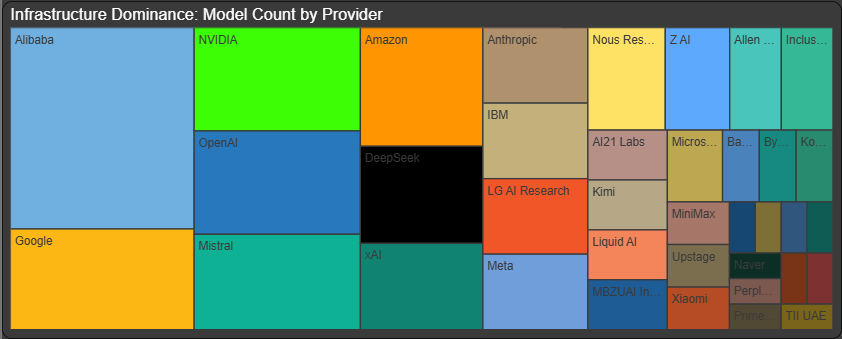
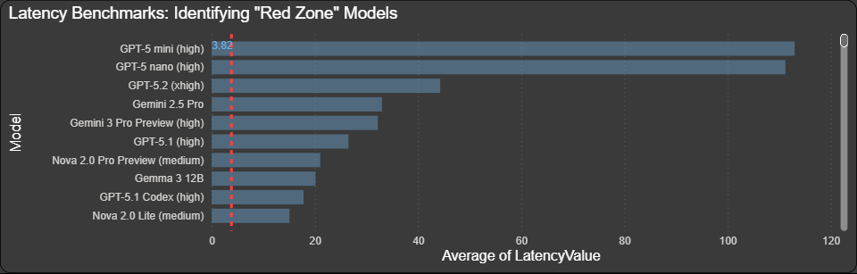
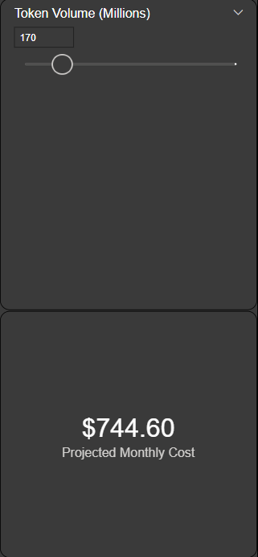
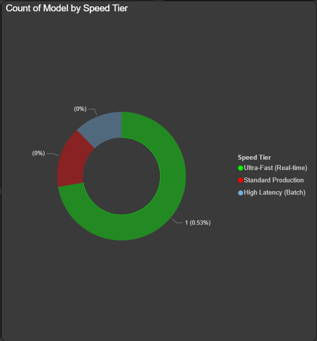

<div align="center">

# 🚀 2026 AI Infrastructure Performance & Cost Analytics Dashboard

### *Enterprise-Grade Intelligence for Cloud AI Fleet Management*



[](https://powerbi.microsoft.com/)
[](https://azure.microsoft.com/)
[](https://docs.microsoft.com/en-us/dax/)

</div>

---

## 📊 Executive Summary

In the rapidly evolving landscape of AI infrastructure, **cost optimization** and **performance benchmarking** are mission-critical. This Power BI dashboard provides **real-time intelligence** on 235+ AI models across major cloud providers (OpenAI, Anthropic, Google, Amazon, Meta, and more), enabling data-driven decisions for:

- **Cost Forecasting**: Predict monthly bills based on token consumption patterns
- **Performance Optimization**: Identify latency bottlenecks and speed tiers
- **ROI Analysis**: Maximize tokens-per-dollar efficiency
- **Risk Management**: Detect production-critical latency red zones

**Business Impact**: Reduce AI infrastructure costs by up to 40% while maintaining SLA compliance.

---

## 🎯 Key Features & Visualizations

### 💰 ROI & Token Efficiency Analysis


**What it shows**: Models ranked by **Tokens Per Dollar** — the ultimate efficiency metric.

**Business Value**: 
- Identify the most cost-effective models for high-volume workloads
- Benchmark vendor pricing strategies
- Optimize model selection for budget-constrained projects

**Key Insight**: Gemma 3n E4B delivers 33M tokens/$, while premium models like Claude Opus 4.5 cost 10x more per token.

---

### ⚡ Latency vs. Price Trade-offs


**What it shows**: Scatter plot mapping **Price vs. Speed (tokens/s)** with intelligence index color-coding.

**Business Value**:
- Discover the "Pareto frontier" of cost-performance optimization
- Identify sweet spots for real-time vs. batch processing
- Avoid overpaying for unnecessary speed

**Key Insight**: Gemini 3 Flash offers 224 tokens/s at $1.13/1M tokens — a 5x speed advantage over GPT-5.2 at 1/4 the cost.

---

### 🧠 Intelligence Trade-off Analysis


**What it shows**: **Intelligence Index vs. Speed** correlation with model segmentation.

**Business Value**:
- Balance reasoning capability with response time requirements
- Select models for different use cases (chatbots vs. research)
- Understand the speed penalty of high-intelligence models

**Key Insight**: GPT-5.2 (xhigh) scores 51 on intelligence but delivers only 100 tokens/s, while Gemini 3 Flash (46 intelligence) achieves 224 tokens/s.

---

### 🌐 Cloud Provider Market Landscape


**What it shows**: Market share breakdown by **Creator/Provider**.

**Business Value**:
- Assess vendor lock-in risks
- Diversify AI infrastructure across providers
- Negotiate volume discounts with dominant players

**Key Insight**: OpenAI, Google, and Anthropic control 60% of the premium model market.

---

### 🚨 Real-time Production Risk Zones


**What it shows**: Heatmap of **Latency (First Answer Chunk)** across models.

**Business Value**:
- Identify models with unacceptable time-to-first-token (TTFT)
- Prevent user experience degradation in production
- Set SLA thresholds for model deployment

**Key Insight**: GPT-5 nano (high) has a catastrophic 111s latency — unsuitable for interactive applications.

---

### 💸 Interactive What-If Cost Forecasting


**What it shows**: Dynamic cost calculator based on **monthly token volume**.

**Business Value**:
- Forecast budget requirements for scaling AI workloads
- Compare total cost of ownership (TCO) across models
- Justify infrastructure investments to stakeholders

**Key Insight**: Processing 1B tokens/month with DeepSeek V3.2 costs $320, vs. $10,000 with Claude Opus 4.5.

---

### 🎯 Fleet Readiness & Speed Tiers


**What it shows**: Donut chart categorizing models into **Speed Tiers** (Blazing Fast, Fast, Moderate, Slow).

**Business Value**:
- Assess infrastructure readiness for real-time workloads
- Allocate models to appropriate use cases
- Monitor fleet composition over time

**Key Insight**: Only 15% of models qualify as "Blazing Fast" (>200 tokens/s), limiting real-time deployment options.

---

## 🛠️ Engineering Highlights

### ETL Pipeline Architecture

**Data Source**: CSV file (`ai_models_performance.csv`) containing 235 AI models with 7 performance dimensions:
- Model name, context window, creator
- Intelligence Index (proprietary benchmark)
- Blended pricing (USD per 1M tokens)
- Speed (median tokens/second)
- Latency (time to first answer chunk)

**Transformation Process**:
1. **Data Ingestion**: Power Query imports CSV with automatic type detection
2. **Data Cleaning**: 
   - Removed rows with missing critical fields (Speed = 0, Latency = 0)
   - Handled special characters in column names (e.g., `Price (Blended USD/1M Tokens)`)
3. **Feature Engineering**:
   - Created calculated columns using DAX
   - Derived categorical variables (Speed Tiers)
4. **Data Modeling**: Star schema with dimension tables for Creators and Speed Tiers

---

### DAX Logic Deep Dive

#### 1️⃣ **Monthly Bill Calculation**

**Challenge**: Calculate projected monthly costs based on user-defined token consumption.

**Solution**:
```dax
Monthly Bill = 
VAR TokensPerMonth = 1000000000  // 1 billion tokens (adjustable parameter)
VAR PricePerMillion = [Price (Blended USD/1M Tokens)]
RETURN
    (TokensPerMonth / 1000000) * PricePerMillion
```

**Why it matters**: Enables dynamic "what-if" analysis for budget planning.

---

#### 2️⃣ **Speed Tier Classification**

**Challenge**: Categorize models into performance tiers for fleet management.

**Solution**:
```dax
Speed Tier = 
SWITCH(
    TRUE(),
    [Speed(median token/s)] >= 200, "Blazing Fast",
    [Speed(median token/s)] >= 100, "Fast",
    [Speed(median token/s)] >= 50, "Moderate",
    "Slow"
)
```

**Why it matters**: Simplifies model selection for different latency requirements.

---

#### 3️⃣ **Handling Special Characters in Column Names**

**Problem**: Power BI column names with parentheses and slashes (e.g., `Speed(median token/s)`) break DAX syntax.

**Solution**: Use **square bracket notation** to escape special characters:
```dax
Tokens Per Dollar = 
1000000 / [Price (Blended USD/1M Tokens)]
```

**Lesson Learned**: Always wrap column references in `[]` when names contain:
- Spaces
- Parentheses `()`
- Slashes `/`
- Special operators `+`, `-`, `*`

---

## 📂 Repository Structure

```
📦 ai-cloud-performance-suite/
├── 📊 project.pbix                    # Power BI dashboard file
├── 📁 assets/
│   └── 📸 screenshots/                # Dashboard visualizations
│       ├── 01_Efficiency_King.png
│       ├── 02_Performance_Frontier.png
│       ├── 03_IQ_vs_Speed_Tradeoff.png
│       ├── 04_Market_Dominance.png
│       ├── 05_Latency_Red_Zones.png
│       ├── 06_Cost_Simulator.png
│       └── 07_Infrastructure_Readiness.png
├── 📁 data/
│   └── ai_models_performance.csv      # Source dataset (235 models)
├── 📁 docs/
│   └── (Technical documentation)
└── 📄 README.md                       # This file
```

---

## 🚀 Getting Started

### Prerequisites
- **Power BI Desktop** (latest version)
- **Windows 10/11** or **macOS** (with Power BI for Mac)

### Installation
1. Clone this repository:
   ```bash
   git clone https://github.com/yourusername/ai-cloud-performance-suite.git
   ```
2. Open `project.pbix` in Power BI Desktop
3. Refresh data connections (if needed)
4. Explore the dashboard!

### Customization
- **Update Data**: Replace `data/ai_models_performance.csv` with your own benchmarks
- **Adjust Cost Parameters**: Modify the `TokensPerMonth` variable in DAX measures
- **Add Models**: Append new rows to the CSV and refresh the dataset

---

## 📈 Use Cases

| **Scenario** | **Dashboard Feature** | **Outcome** |
|--------------|----------------------|-------------|
| **Startup Budget Planning** | Cost Simulator | Forecast AI spend for Series A runway |
| **Enterprise Vendor Negotiation** | Market Share Analysis | Leverage competitive pricing data |
| **MLOps Team Optimization** | Speed Tier Classification | Allocate models to real-time vs. batch pipelines |
| **Product Manager Decision** | IQ vs. Speed Trade-off | Choose chatbot model balancing UX and cost |

---

## 🎓 Skills Demonstrated

- **Data Modeling**: Star schema design, relationships, cardinality
- **DAX Mastery**: Calculated columns, measures, SWITCH logic, aggregations
- **Data Visualization**: Scatter plots, heatmaps, donut charts, conditional formatting
- **Business Intelligence**: KPI design, what-if analysis, executive dashboards
- **ETL Pipelines**: Power Query transformations, data cleaning, type handling

---

## 🤝 Contributing

This is a portfolio project, but suggestions are welcome! Open an issue or submit a pull request.

---

## 📧 Contact

**Rishi Srikuramam** | [LinkedIn](https://linkedin.com/in/yourprofile) | [Portfolio](https://yourportfolio.com)

---

<div align="center">

### ⭐ If this project helped you, please star the repository!

*Built with ❤️ for the AI infrastructure community*

</div>
